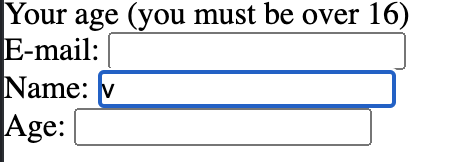
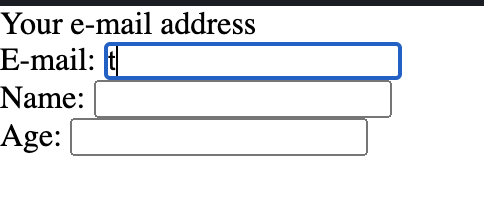

# Closure

A closure is the combination of a function bundled together (enclosed) with references to its surrounding state **(the lexical environment)**. In other words, a closure gives you access to an outer function’s scope from an inner function. In JavaScript, closures are created every time a function is created, at function creation time.

### In Simple Explanation:

A closure is a feature in JavaScript where an inner function has access to the outer (enclosing) function’s variables — a scope chain.

#### To Understand the closure, we should consider the Lexical Scope. Instead of giving you all about the Theory, I am going to give you small example:

```js
function init() {
  var name = "Mozilla"; // name is a local variable created by init
  function displayName() {
    // displayName() is the inner function, a closure
    alert(name); // use variable declared in the parent function
  }
  displayName();
}
init();
```

**_init()_** creates a local variable called **name** and a function called **_displayName()_**. The **_displayName()_** function is an inner function that is defined inside **_init()_** and is available only within the body of the **_init()_** function. Note that the **_displayName()_** function has no local variables of its own. However, since inner functions have access to the variables of outer functions, **_displayName()_** can access the variable name declared in the parent function, **_init()_**.

> Important Note:

notice that the **_alert()_** statement within the **_displayName()_** function successfully displays the value of the name variable, which is declared in its parent function. **This is an example of lexical scoping**, which describes how a parser resolves variable names when functions are nested. The word lexical refers to the fact that lexical scoping uses the location where a variable is declared within the source code to determine where that variable is available. Nested functions have access to variables declared in their outer scope.

### Now you should understand what Lexical Scope is! But what is actually a Lexical Environment?

#### Another Example:

```js
function makeFunc() {
  var name = "Mozilla";
  function displayName() {
    alert(name);
  }
  return displayName;
}

var myFunc = makeFunc();
myFunc();
```

Running this code has exactly the same effect as the previous example of the **_init()_** function above. What's different (and interesting) is that the **_displayName()_** inner function is returned from the outer function **before** being executed.

At first glance, it might seem unintuitive that this code still works. In some programming languages, the local variables within a function exist for just **the duration** of that function's execution. Once **_makeFunc()_** finishes executing, **you might expect that the name variable would no longer be accessible**. However, because the code still works as expected, this is obviously not the case in JavaScript.

The reason is that functions in JavaScript form closures. A closure is the combination of a function and the <mark>lexical environment</mark> within which that function was declared. This environment consists of any local variables that were in-scope at the time the closure was created. In this case, **_myFunc_** is a reference to **the instance** of the function **_displayName_** created when **_makeFunc_** is run. **The instance of displayName** maintains a reference to its <mark>lexical environment</mark>, within which the variable name exists. For this reason, when **_myFunc_** is invoked, the variable name remains available for use, and **"Mozilla"** is passed to alert.

#### To get an idea, we will console.dir() to see what is happening.

```js
console.dir(myFunc);

ƒ displayName()
    arguments: null
    caller: null
    length: 0
    name: "displayName"
    prototype: {constructor: ƒ}
    __proto__: ƒ ()
    [[FunctionLocation]]: VM174:3
    [[Scopes]]: Scopes[2]
    0: Closure (makeFunc) {name: "Mozilla"}
    1: Global {parent: Window, opener: null, top: Window, length: 6, frames: Window, …}
```

As you can see the instance that we created

```js
var makeFunc = makeFunc(); //once this instance is declared, it begins to create lexical Environment.
console.dir(myFunc);
```

It refers to the instance of **displayName** and the declared instance stores as **the closure (makeFunc)**.

#### Let's try another Example, I would like to make you all understand completely about the closure.

```js
function makeAdder(x) {
  return function (y) {
    return x + y;
  };
}
var add5 = makeAdder(5); // add5 closure, stored at lexical environment
var add10 = makeAdder(10); // add10 closure, stored at lexical environment
console.log(add5(2)); // 7
console.log(add10(2)); // 12
```

In this example, we have defined a function **_makeAdder(x)_**, that takes a single argument **x**, and returns a new function. The function it returns takes a single argument **y**, and returns **the sum of x and y**.

In essence, **_makeAdder_** is a function factory. It creates functions that can add a specific value to their argument. In the above example, the function factory creates two new functions—one that **adds 5** to its argument, and one that **adds 10**.

**add5 and add10 are both closures**. They share the same function body definition, but <mark>store different lexical environments</mark>. In **add5's** lexical environment, **x is 5**, while in the lexical environment for **add10, x is 10**.

## Practical closures

Closures are useful because they let you associate data (the lexical environment) with a function that operates on that data. This has obvious parallels to object-oriented programming, where objects allow you to associate data (the object's properties) with one or more methods.

Consequently, you can use a closure anywhere that you might normally use an object with only a single method.

Situations where you might want to do this are particularly common on the web. Much of the code written in front-end JavaScript is event-based. You define some behavior, and then attach it to an event that is triggered by the user (such as a click or a keypress). The code is attached as a callback (a single function that is executed in response to the event).

For instance, suppose we want to add buttons to a page to adjust the text size. One way of doing this is to specify the font-size of the body element (in pixels), and then set the size of the other elements on the page (such as headers) using the relative em unit:

```CSS
body {
  font-family: Helvetica, Arial, sans-serif;
  font-size: 12px;
}

h1 {
  font-size: 1.5em;
}

h2 {
  font-size: 1.2em;
}
```

Such interactive text size buttons can change the font-size property of the body element, and the adjustments are picked up by other elements on the page thanks to the relative units.

Here's the JavaScript:

```js
function makeSizer(size) {
  return function () {
    document.body.style.fontSize = size + "px";
  };
}

var size12 = makeSizer(12);
var size14 = makeSizer(14);
var size16 = makeSizer(16);
```

**_size12_**, **_size14_**, and **_size16_** are now functions that resize the body text to 12, 14, and 16 pixels, respectively. You can attach them to buttons (in this case hyperlinks) as demonstrated in the following code example.

```js
document.getElementById("size-12").onclick = size12;
document.getElementById("size-14").onclick = size14;
document.getElementById("size-16").onclick = size16;
```

```html
<a href="#" id="size-12">12</a>
<a href="#" id="size-14">14</a>
<a href="#" id="size-16">16</a
```

[To see how it works , click here](https://jsfiddle.net/vnkuZ/7726/)

## Emulating private methods with closures

Languages such as Java allow you to declare methods as private, meaning that they can be called only by other methods in the same class.

JavaScript does not provide a native way of doing this, but **it is possible to emulate private methods using closures**. Private methods aren't just useful for restricting access to code. They also provide a powerful way of managing your global namespace.

The following code illustrates how to use closures to define public functions that can access private functions and variables.

```js
var counter = (function () {
  var privateCounter = 0;
  function changeBy(val) {
    privateCounter += val;
  }

  return {
    increment: function () {
      changeBy(1);
    },

    decrement: function () {
      changeBy(-1);
    },

    value: function () {
      return privateCounter;
    },
  };
})();

console.log(counter.value()); // 0.

counter.increment();
counter.increment();
console.log(counter.value()); // 2.

counter.decrement();
console.log(counter.value()); // 1.
```

In previous examples, each closure had its own lexical environment. Here though, there is a single lexical environment that is shared by the three functions: **counter.increment**, **counter.decrement**, and **counter.value**.

The shared lexical environment is created in the body of an anonymous function, which is executed as soon as it has been defined (also known as an [IIFE](https://developer.mozilla.org/en-US/docs/Glossary/IIFE)). The lexical environment contains two private items: a variable called **_privateCounter_**, and a function called **_changeBy_**. You can't access either of these private members from outside the anonymous function. Instead, you can access them using the three public functions that are returned from the anonymous wrapper.

Those three public functions are closures that share the same lexical environment. Thanks to JavaScript's lexical scoping, they each have access to the **_privateCounter_** variable and the **_changeBy function_**.

But how about I would like to create a lexical Environment?
let's see how it looks!

```JS
var makeCounter = function() {
  var privateCounter = 0;
  function changeBy(val) {
    privateCounter += val;
  }
  return {
    increment: function() {
      changeBy(1);
    },

    decrement: function() {
      changeBy(-1);
    },

    value: function() {
      return privateCounter;
    }
  }
};

var counter1 = makeCounter(); // lexical Environment
var counter2 = makeCounter(); // lexical Environment

alert(counter1.value());  // 0.

counter1.increment();
counter1.increment();
alert(counter1.value()); // 2.

counter1.decrement();
alert(counter1.value()); // 1.
alert(counter2.value()); // 0.
```

> Notice how the two counters maintain their independence from one another. Each closure references a different version of the privateCounter variable through its own closure. Each time one of the counters is called, its lexical environment changes by changing the value of this variable. Changes to the variable value in one closure don't affect the value in the other closure.

## Closure Scope Chain

### Every closure has three scopes:

- Local Scope (Own scope)
- Outer Functions Scope
- Global Scope

A common mistake is not realizing that, in the case where the outer function is itself a nested function, access to the outer function's scope includes the enclosing scope of the outer function—effectively creating a chain of function scopes. To demonstrate, consider the following example code.

```js
// global scope
var e = 10;
function sum(a) {
  return function (b) {
    return function (c) {
      // outer functions scope
      return function (d) {
        // local scope
        return a + b + c + d + e;
      };
    };
  };
}

console.log(sum(1)(2)(3)(4)); // log 20

// You can also write without anonymous functions:

// global scope
var e = 10;
function sum(a) {
  return function sum2(b) {
    return function sum3(c) {
      // outer functions scope
      return function sum4(d) {
        // local scope
        return a + b + c + d + e;
      };
    };
  };
}

var s = sum(1);
var s1 = s(2);
var s2 = s1(3);
var s3 = s2(4);
console.log(s3); //log 20
```

In the example above, there's a series of **nested functions**, all of which have access to the outer functions' scope. In this context, <mark>we can say that closures have access to all outer function scopes.</mark>

### Confused yet? Relax. If you get comfortable with those understandings, please continue the below.

## Creating closures in loops: A common mistake

Prior to the introduction of the let keyword in ECMAScript 2015, a common problem with closures occurred when you created them inside a loop. To demonstrate, consider the following example code.

For an instance, we will have some HTML code below:

```html
<p id="help">Helpful notes will appear here</p>
<p>E-mail: <input type="text" id="email" name="email" /></p>
<p>Name: <input type="text" id="name" name="name" /></p>
<p>Age: <input type="text" id="age" name="age" /></p>
```

and Javascript script below:

```JS
function showHelp(help) {
  document.getElementById('help').innerHTML = help;
}

function setupHelp() {
  var helpText = [
      {'id': 'email', 'help': 'Your e-mail address'},
      {'id': 'name', 'help': 'Your full name'},
      {'id': 'age', 'help': 'Your age (you must be over 16)'}
    ];

  for (var i = 0; i < helpText.length; i++) {
    var item = helpText[i];
    document.getElementById(item.id).onfocus = function() {
      showHelp(item.help);
    }
  }
}

setupHelp();
```

[Try running this code here (errors)](https://jsfiddle.net/v7gjv/8164/)

The expectation whether I click each input tag in Browser, I want to see the changes of **help text** as shown in the array respectively. However, it doesn't work at all.



If you try this code out, you'll see that it doesn't work as expected. No matter what field you focus on, the message about your age will be displayed.

The reason for this is that the functions assigned to onfocus are closures; they consist of the function definition and the captured environment from the setupHelp function's scope. Three closures have been created by the loop, but **each one shares the same single lexical environment**, which has a variable with changing values (item). This is because the **variable item is declared with var and thus has function scope due to hoisting**. The value of item.help is determined when the onfocus callbacks are executed. Because the loop has already run its course by that time, the item variable object (shared by all three closures) **has been left pointing to the last entry in the helpText list.**

One solution in this case is to use more closures: in particular, to use a function factory as described earlier:

```JS
function showHelp(help) {
  document.getElementById('help').innerHTML = help;
}

function makeHelpCallback(help) {
  return function() {
    showHelp(help);
  };
}

function setupHelp() {
  var helpText = [
      {'id': 'email', 'help': 'Your e-mail address'},
      {'id': 'name', 'help': 'Your full name'},
      {'id': 'age', 'help': 'Your age (you must be over 16)'}
    ];

  for (var i = 0; i < helpText.length; i++) {
    var item = helpText[i];
    document.getElementById(item.id).onfocus = makeHelpCallback(item.help);
  }
}

setupHelp();
```

[Try Running this code here (fixed)](https://jsfiddle.net/v7gjv/9573/)



Now you can see every time we click each Input tag, the Help text shows respectively. Because we created the **makeHelpCallback** function creates a new lexical environment for each callback, in which help refers to the corresponding string from the helpText array.

But I know some of you guys are really stubborn, Why can't we fix the previous one instead of creating callback function!!! Relax, Here is other way to write the above using anonymous closures is:

```js
function showHelp(help) {
  document.getElementById("help").innerHTML = help;
}

function setupHelp() {
  var helpText = [
    { id: "email", help: "Your e-mail address" },
    { id: "name", help: "Your full name" },
    { id: "age", help: "Your age (you must be over 16)" },
  ];

  for (var i = 0; i < helpText.length; i++) {
    (function () {
      var item = helpText[i];
      document.getElementById(item.id).onfocus = function () {
        showHelp(item.help);
      };
    })(); // Immediate event listener attachment with the current value of item (preserved until iteration).
  }
}

setupHelp();
```

Not satified ? **var** is old, trying another new ES5 for an instance? ok then! Use **Let**. Or you don't want to use more closures? Try the solution below:

```JS
function showHelp(help) {
  document.getElementById('help').innerHTML = help;
}

function setupHelp() {
  var helpText = [
      {'id': 'email', 'help': 'Your e-mail address'},
      {'id': 'name', 'help': 'Your full name'},
      {'id': 'age', 'help': 'Your age (you must be over 16)'}
    ];

  for (let i = 0; i < helpText.length; i++) {
    let item = helpText[i];
    document.getElementById(item.id).onfocus = function() {
      showHelp(item.help);
    }
  }
}

setupHelp();
```

This example uses let instead of var, so every closure binds the block-scoped variable, meaning that no additional closures are required.

But unfortunately, My master Mr Khanh Tran, I predict he does not want **for ... loop** what are we going to do? Relax try this one below:

```js
function showHelp(help) {
  document.getElementById("help").innerHTML = help;
}

function setupHelp() {
  var helpText = [
    { id: "email", help: "Your e-mail address" },
    { id: "name", help: "Your full name" },
    { id: "age", help: "Your age (you must be over 16)" },
  ];

  helpText.forEach(function (text) {
    document.getElementById(text.id).onfocus = function () {
      showHelp(text.help);
    };
  });
}

setupHelp();
```

This is another alternative could be to use forEach() to iterate over the helpText array and attach a listener to each <p>, as shown:

## Lastly, Performance considerations

It is unwise to unnecessarily create functions within other functions if closures are not needed for a particular task, as it will negatively affect script performance both in terms of processing speed and memory consumption.

For instance, when creating a new object/class, methods should normally be associated to the object's prototype rather than defined into the object constructor. The reason is that whenever the constructor is called, the methods would get reassigned (that is, for every object creation).

Consider the following case:

```JS
function MyObject(name, message) {
  this.name = name.toString();
  this.message = message.toString();
  this.getName = function() {
    return this.name;
  };

  this.getMessage = function() {
    return this.message;
  };
}
```

Because the previous code does not take advantage of the benefits of using closures in this particular instance, we could instead rewrite it to avoid using closure as follows: **God of JS prototype :)**

```JS
function MyObject(name, message) {
  this.name = name.toString();
  this.message = message.toString();
}
MyObject.prototype = {
  getName: function() {
    return this.name;
  },
  getMessage: function() {
    return this.message;
  }
};
```

Unfortunately, However, redefining the prototype is not recommended. The following example instead appends to the existing prototype:

```JS
function MyObject(name, message) {
  this.name = name.toString();
  this.message = message.toString();
}
MyObject.prototype.getName = function() {
  return this.name;
};
MyObject.prototype.getMessage = function() {
  return this.message;
};
```

In the two previous examples, the inherited prototype can be shared by all objects and the method definitions need not occur at every object creation.
