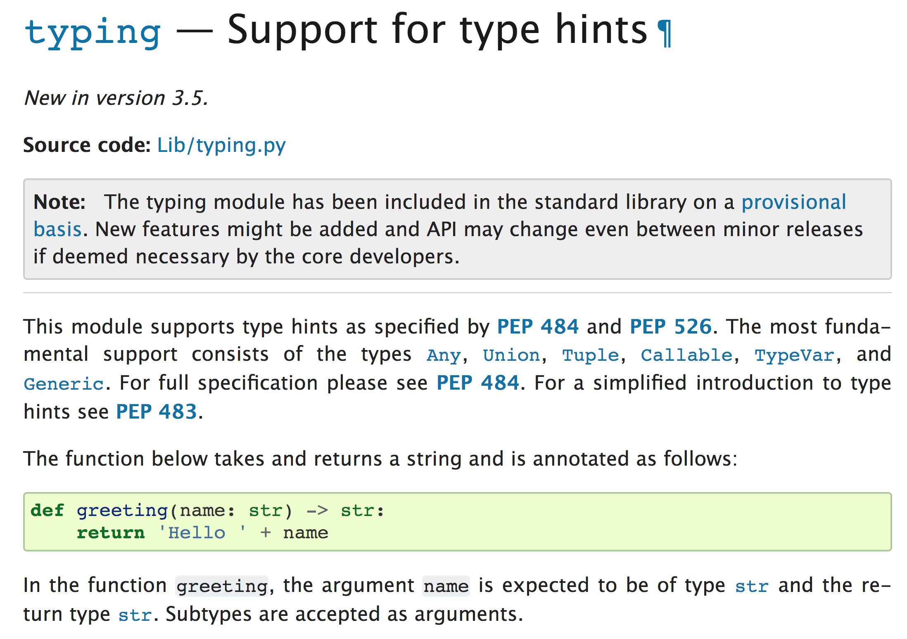

# TypeScript With Me
---
## *JavaScript that scales.*

TypeScript is a typed superset of JavaScript that compiles to plain JavaScript.


# TypeScript

``` js
// JavaScript, types are implicit
const add = (a, b) => a + b
```

``` ts
// TypeScript, types are explicit
const add = (a: number, b: number): number => a + b
```

# Why Types?

- Catch bugs
- Catch bugs (earlier)
- Documentation / improve productivity
- GraphQL has a type system
- **🤩 Refactoring**

---


---

Java?

```java
public class Main {
    public static void main(String[] args) {
        int number1 = 10;
        String message = new String("Hello World! ");
        System.out.println(message + number1);
    }
}
```

---


---


---

# Types are all the rage

---




Python

---


---

> _Matz_: Yeah
the third major goal of the Ruby 3 is adding some kind of static typing while keeping the duck typing
so some kind of structure for soft-typing or something like that.

-- [Ruby 3x3: Matz Koichi and Tenderlove on the future of Ruby Performance][]

[ruby 3x3: matz koichi and tenderlove on the future of ruby performance]: https://blog.heroku.com/ruby-3-by-3

Ruby

---

# Why TypeScript?


- gradual pragmatic
- good adoption story
- Community adoption
- VS Code & Language server
- Apollo
- Formik are authored in it

---

## Gradual Adoption Story

- All JS is valid TS!
- Rename `*.js` -> `*.ts{x}`
- Introduce types for libraries
- Dial up the strictness (towards `--strict` mode)

    ```
    --noImplicitAny
    --strictNullChecks
    --strictFunctionTypes
    ```

---

## Community Adoption


---

## Tooling!


---
## Library Support

- Apollo & formik are authored in TypeScript
- React very well supported

---

## How to get started

- All JS is valid TS!
- Rename `*.js` -> `*.ts{x}`
- Introduce types for libraries
- Dial up the strictness (towards `--strict` mode)

    ```
    --noImplicitAny
    --strictNullChecks
    --strictFunctionTypes
    ```

## Core concept 
- Type system
- Self Confidence
- Decipherable
- Observable
- Contractor
- Transparent
- Isolate the problem quickly
- Non-exception Failures 
- Explicit Types
- Erased Types
- DownLeveling
- Strictness

## Learn With CheatSheet 

 
 
 

## Common Questions:
1. Differences Between Type Aliases and Interfaces? *Type aliases and interfaces are very similar, and in many cases you can choose between them freely. Almost all features of an interface are available in type , the key distinction is that a type cannot be re-opened to add new properties vs an interface which is always extendable.*

## Typescript in Advance
- https://www.typescriptlang.org/assets/typescript-handbook.pdf

## Work In Process
1. Best practices for exception handling in typescript?
https://kaoengine.com/best-practices-for-exception-handling-in-typescript